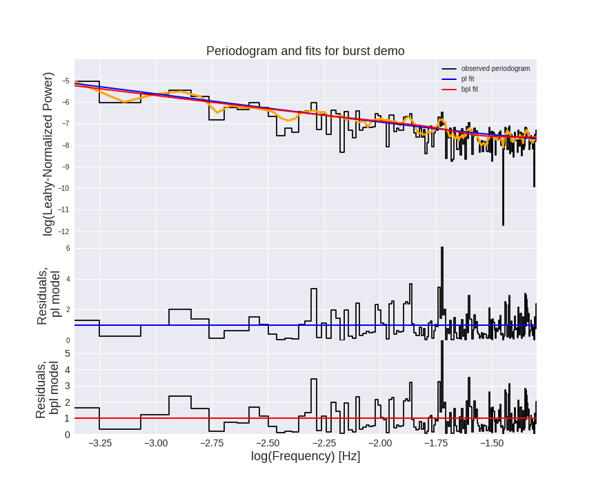

BayesPSD applied to *Fermi* LAT light curve
===========================================

`BayesPSD`: Bayesian power spectral analysis tools developed by [Daniela Huppenkothen](http://huppenkothen.org). 

This is a fork of the [original repo](https://github.com/dhuppenkothen/BayesPSD). This branch has the modified jupyter notebook to read and process the *Fermi* LAT light curve for NGC1275 (Perseus), performing a Bayesian search for quasi-periodic oscillations (QPOs). The results from this analysis were reported in [arXiv:1811.07215](https://arxiv.org/abs/1811.07215).

For instructions on how to apply this analysis to your data, please see [installation below](#installation).

# Requires

- python 2.7 or later
- numpy
- scipy
- matplotlib

# Recommended

- emcee (for efficient MCMC): https://github.com/dfm/emcee
- Jupyter notebooks (for running the demo)
- acor: https://github.com/dfm/acor 
- statsmodels (for estimating the inverse covariance, unless using BFGS): https://github.com/statsmodels/statsmodels
- seaborn (for pretty plotting)


# Installation

1. Clone this repository in a directory on your home system:
 
```
cd /my/directory/
git clone https://github.com/rsnemmen/BayesPSD
```
 
2. add `/my/directory/` to your `$PYTHONPATH` variable either in `.profile` or `.bashrc`; this depends on your system! 
 
3. Congratulations, you should now be able to use the code in the repository.

# Reproducing the NGC 1275 QPO analysis

1. Change to the branch which contains the *Fermi* LAT analysis example, otherwise you will not see the modified files:

```
git checkout n1275
```

2. Open the `./docs/Demo.ipynb` notebook and run it. At the end of the analysis, you should get a couple of new `png` files inside the docs folder. The most important one will be the `demo_ps_fit.png` which shows the power spectrum compared to two noise models. 

